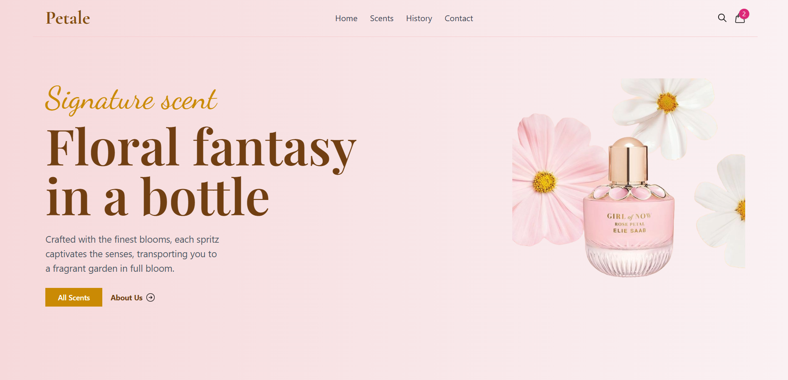

<h1 align="center">🌸 Petale - Rose Petal Perfume Website</h1>

  A romantic and elegant single-brand perfume website built with simplicity and interactivity in mind.

  
  
  
  
  

---

## Overview

**Petale** is a front-end perfume eCommerce concept site focused on showcasing rose-inspired scents with an intuitive user interface. The website combines elegance with functionality — from scent exploration to cart management — offering a clean and luxurious browsing experience.

---

## ✨ Key Features

- 🌸 **Beautiful Hero Sections** with flower-petal-themed background art
- 🛍️ **Interactive Scents Page**  
  - Add perfumes to cart  
  - View cart items in a modern dropdown-style popup  
  - See total price dynamically  
  - Remove individual items from cart  
  - Cart data persists using **Local Storage**
- 📄 **About Page** – Brand philosophy and product inspiration
- 📬 **Contact Page** – Clean contact form with name, email & message
- 💎 **Fully Responsive** – Looks great on mobile, tablet, and desktop

---

## 📸 Preview

<!-- Optionally insert a screenshot here -->
 <!-- Replace with your actual image -->

---

## 🔧 Technologies Used

| Technology | Description |
|------------|-------------|
| **HTML5** | Semantic layout and structure |
| **Tailwind CSS** | Utility-first responsive styling |
| **DaisyUI** | Pre-designed Tailwind components |
| **JavaScript (Vanilla)** | Cart interactivity & DOM manipulation |
| **LocalStorage** | Save and retrieve cart items persistently |

---

## 🚀 How It Works

1. Users can explore different perfume scents.
2. Clicking "Add to Cart" adds the item to the cart dropdown in the navbar.
3. The cart dynamically updates the number of items and the total price.
4. Items can be removed, and everything is synced with `localStorage`.
5. Contact form allows visitors to send their feedback or questions.
